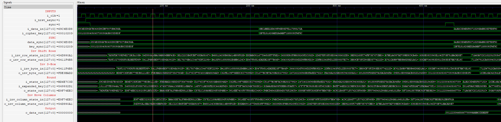

# Implementing a 128-bit AES 
## Encryption and Decryption 
An implementation of AES Encryption which is partially pipelined i.e. sequential but internally piplined.

An implementation of AES Decryption which is partially piplined i.e. sequential but internally piplined.
