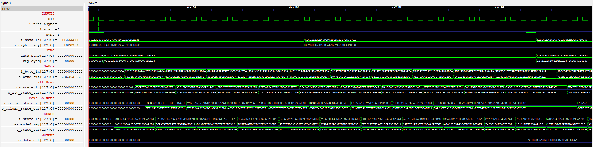
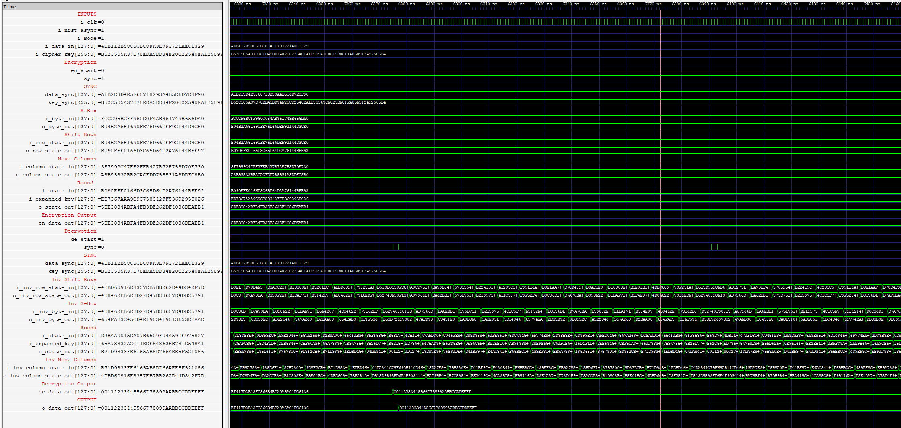
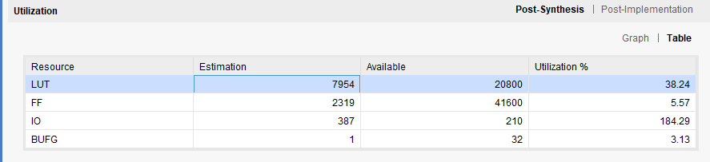

# RTL implementation of a AES supporting (128/192/256) key sizes 
## Encryption
AES-256 Encryption is shown below 

## Decryption 
AES-256 Decryption is shown below for the output obtain in the encryption shown above.

The implementation is sequential, reusing the same hardware logic across rounds, but the resouce utilization is slightly high compared to standalone implementations due to the use of an if-else statement rather than a case statement which make the design more sequential and reduces the parallelism causing a slight increase in resouce utilization.
## Resource Utilization
Resource Utilization of a generic implementation

Resource utilization in the case of standalone implementation

