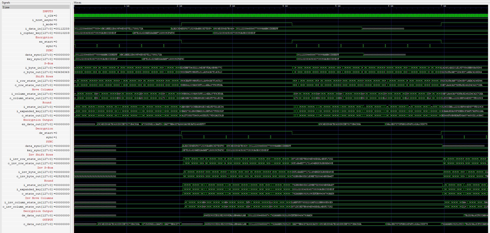
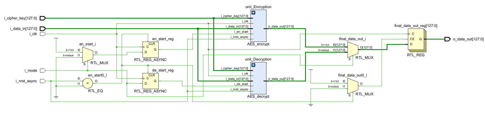
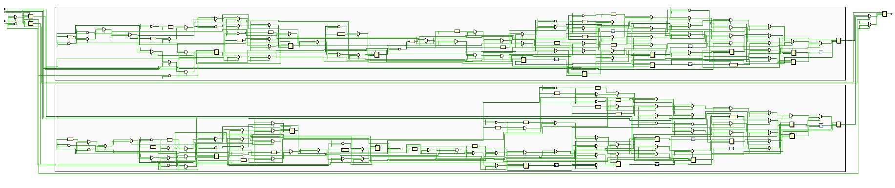
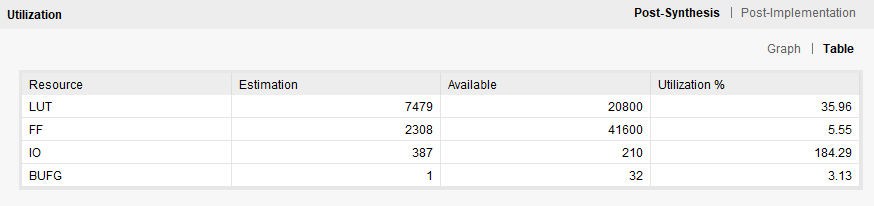

# RTL implementation of a 128-bit AES 

## Encryption 
An implementation of AES Encryption which is partially pipelined i.e. sequential but internally piplined.

## Decryption
An implementation of AES Decryption which is partially piplined i.e. sequential but internally piplined.

# Synthesis of the design 

## Utilization 
- The current LUT and FF utilization is quite low 35.96% and 5.55% but the IO utilization is quite high this is due to the fact that the inputs plain text, cipher key and encrypted text are all taken as inputs and outputs at this stage and each are 128 bits wide. To reduce the IO utilization a Wishbone could be implemented that could read the plain text from registers and write back the encrypted text and vice versa. 
- The current implemenation is a partial pipline i.e. the hardware for different rounds are re-used and hence making it resource efficient, and in the top module a control signal "i_mode" is used which determines if encryption or decryption is performed. 

