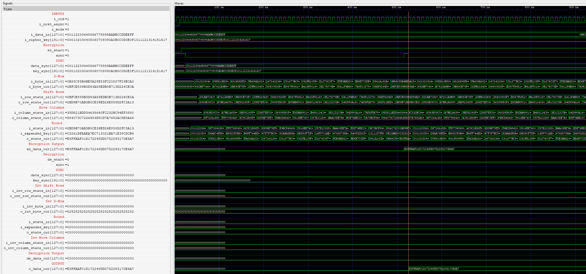
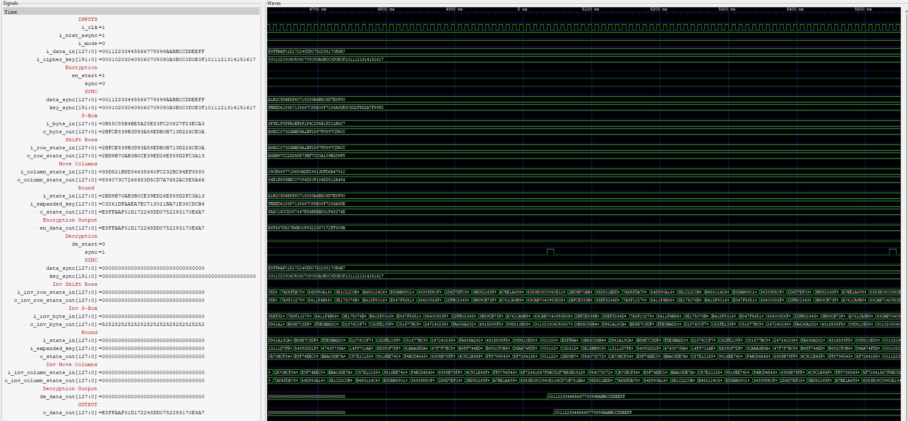

# RTL implementation of a 192-bit AES 
## Encryption 

## Decryption 

The output obtained from the encryption is used as an input for decryption to check to verify the correctness of the implementation. The implementation is a partial pipline giving a balance between throughput and resource utilization. 
