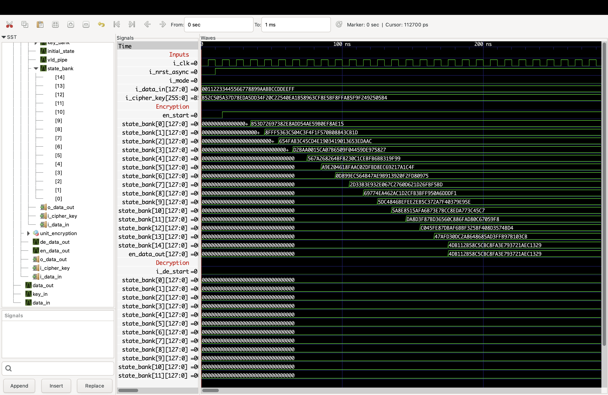
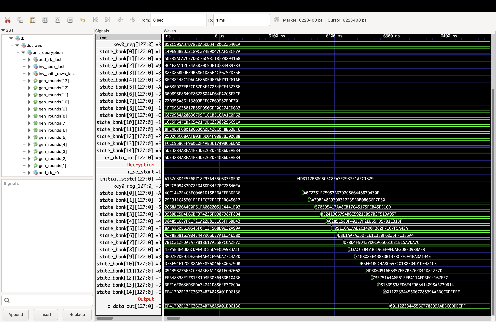
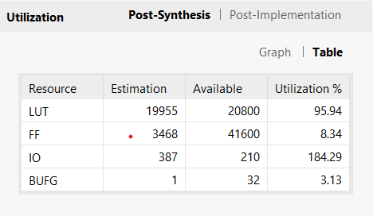

# RTL implementation of an AES Core (VHDL) — Serial & Pipelined
- Two RTL implementations of AES-128/192/256 cores.

- Serial (iterative) : unitAESEncrypt.vhd, unitAESDecrypt.vhd : One reusable round datapath; minimal area; multi-cycle latency for resource constrainted applications.
- Piplined (round piplined) : unitAESEncrypt_piplined.vhd, unitAESDecrypt_piplined.vhd : One stage per round for max throughput, keys pipelined in lockstep.
- All blocks parameterize and the top module is as follows:

## Architecture 
### Top Module 
``` bash 
entity AES is 
    generic (
        KEY_SIZE  : integer := 128; -- can be 128/192/256
        TEXT_SIZE : integer := 128; -- Always 128
        ROUNDS    : integer := 10 -- # of rounds depends on key size for 128 -> 10, 192 -> 12, 256 -> 14
    );
    port (
        i_clk        : in std_ulogic;
        i_nrst_async : in std_ulogic;
        i_mode       : in std_ulogic; -- '0' for encryption and '1' decryption 
        i_data_in    : in std_ulogic_vector(TEXT_SIZE-1 downto 0);
        i_cipher_key : in std_ulogic_vector(KEY_SIZE-1 downto 0);
        o_data_out   : out std_ulogic_vector(TEXT_SIZE-1 downto 0)
    );
end entity AES;
```
- Selects Encryption or Decryption by i_mode and wires to the cores. 
- ```i_mode='0' ``` → encryption path active
- ```i_mode='1' ``` → decryption path active

### Serial (iterative)
- Ports for Encrypt 
```bash 
port (
        i_clk : in std_ulogic;
        i_nrst_async : in std_ulogic;
        i_en_start : in std_ulogic;
        i_data_in  : in std_ulogic_vector(TEXT_SIZE-1 downto 0);
        i_cipher_key : in std_ulogic_vector(KEY_SIZE-1 downto 0);
        o_data_out : out std_ulogic_vector(TEXT_SIZE-1 downto 0)
    );
```
- On i_en_start='1', the core syncs inputs (data_sync, key_sync) and drops a local sync flag. 
- The data now loops the four stages serially SubBytes -> ShiftRows -> MixColumns -> AddRoundKey.
- A counter is used to track the changes and the output is pulled to the state once the counter reaches ROUNDS*4.
- For the final round it bypasses MixColumns.
- Output is assigned after the last step; an extra cycle is used to register it at the output of the top module.

### Round Piplined 
- The ports reamin the same for both serial and piplined implementations. 
- Each stage registers its state and the key for that stage in the same cycle, keeping them aligned.
- Final round bypasses MixColumns.

## Latency & Throughput 
- Clock Period : 10 ns;
```bash 
    # Serial 
    Latency(cycles) ≈ 4*ROUNDS + 2 -- once cycle to sync data and the other to latch
    Latency(time)   ≈ (4*ROUNDS + 2) * 10 ns
    AES-128 (10r):  ≈ 42 cycles  → ~420 ns
    AES-192 (12r):  ≈ 50 cycles  → ~500 ns
    AES-256 (14r):  ≈ 58 cycles  → ~580–590 ns
    Throughput = 1 block / (4*ROUNDS + 2) * 10 ns
    # Piplined 
    Latency ≈ (ROUNDS + 2) * 10 ns
    Throughput = 1 block / cycle after the pipe fills i.e. with an intial delay of (ROUNDS+2)*10 ns 
```


## Encryption
AES-256 Encryption is shown below 


## Decryption 
AES-256 Decryption is shown below for the output obtain in the encryption shown above.


The implementation is sequential, reusing the same hardware logic across rounds, but the resouce utilization is slightly high compared to standalone implementations due to the use of an if-else statement rather than a case statement which make the design more sequential and reduces the parallelism causing a slight increase in resouce utilization. In the case of piplined implementation there is a higher thorughput with greater resource utilization.
## Resource Utilization
Resource Utilization of a generic implementation

Resource utilization in the case of standalone implementation

Resource utlization in the case of piplined implementation 

