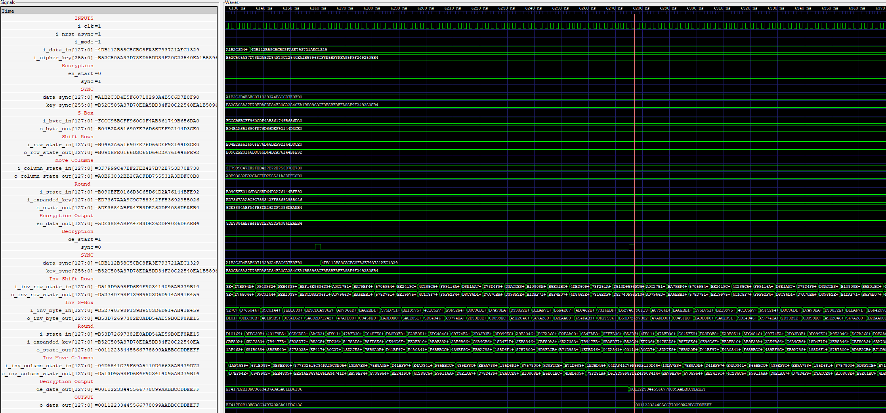
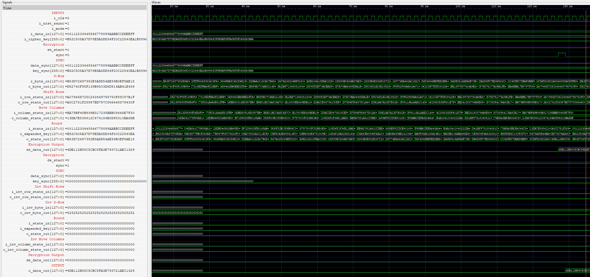

# RTL implementation of a 256-bit AES 
## Encryption 

## Decryption 

The output obtained from the encryption is used as an input for decryption to check to verify the correctness of the implementation. The implementation  is sequential, reusing the same hardware logic across rounds..
